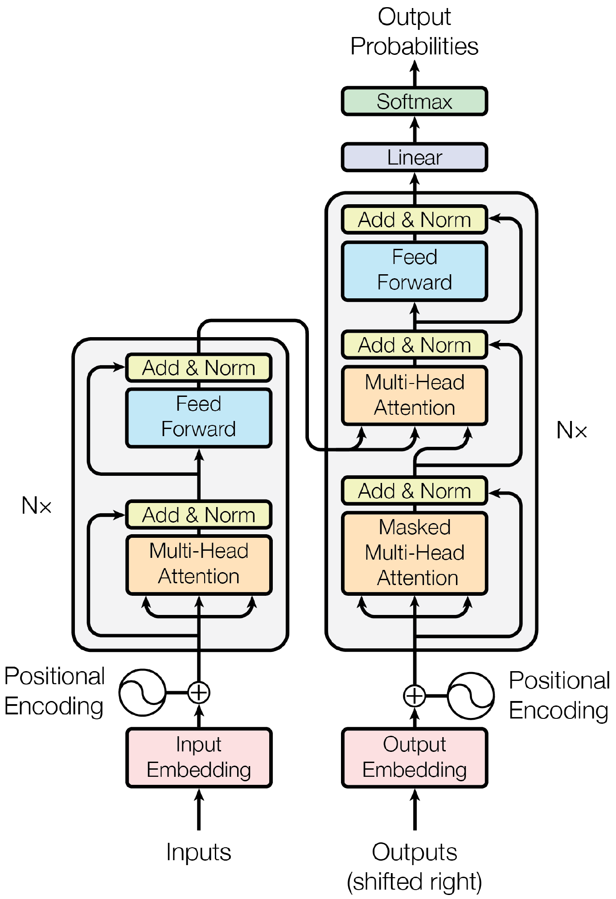
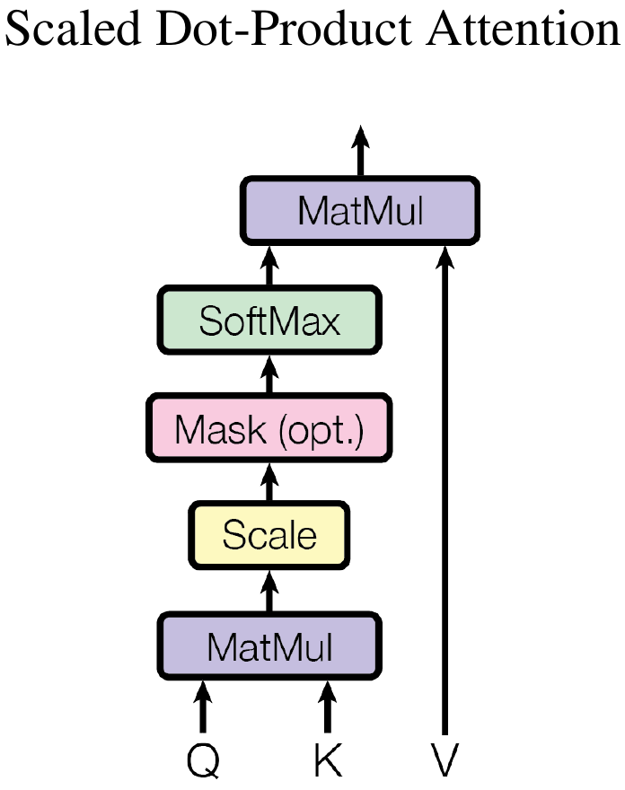
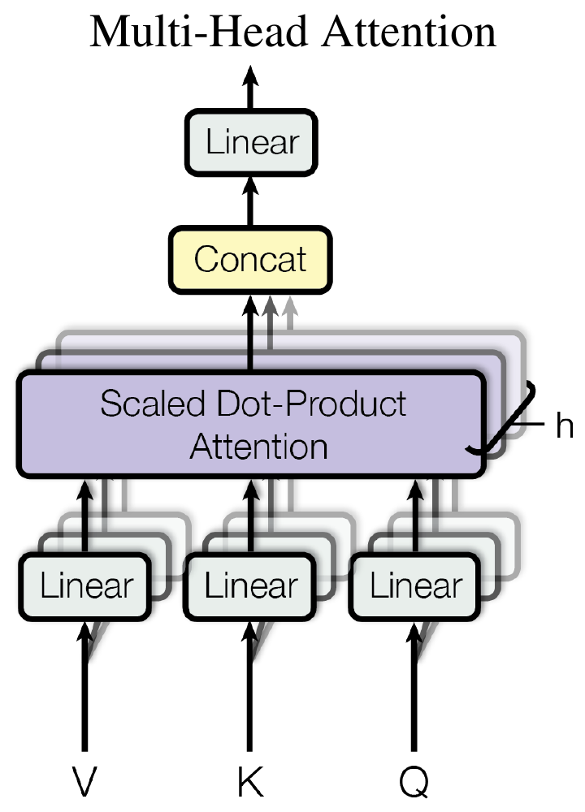

rnn 难以并行，

而 cnn 对间隔较远的两个位置融合的代价较大，而 transofrmer 能一次看到所有信息。

使用了 multi-head attention，来模仿 CNN 多输出通道的效果，不同的通道可以识别不同的模式。

#### 1 Encoder-Decoder

当前比较好的序列转录模型都使用 encoder-decoder 结构：

- encoder 将输入的符号表达序列 $(x_1,\dots,x_n)$ 映射为连续表达 $\mathbf z=(z_1,\dots,z_n)$；
- decoder 则基于 $\mathbf z$ ，以 **auto-regressive** 的方式生成输出的符号序列 $(y_1,\dots,y_m)$。

所谓自回归，就是过去时刻的输出，会作为当前时刻的输入。

##### Encoder

编码器由 $N=6$ 个相同的层组成，每一层有两个子层，**multi-head-self-attention** 和 **position-wise-fcn**。每个子层都使用了一个残差连接，后面使用一个 layernorm，因此输出是：
$$
\text{layernorm}(x + \text{sublayer}(x))
$$
为了使用残差连接，模型中的所有子层，包括嵌入层，输出的维度都是 $d_\text{model}=512$。

##### Decoder

解码器与编码器十分类似，也是由 6 个相同的层构成，每个层理有两个和编码器一样的子层，但还有第三个子层。因为要避免在训练解码器时，在预测第 $t$​​ 个词的时候，看到后面的信息，因此使用了一个带掩码的自注意力机制，从而使得训练和预测的时候行为一致。

#### 2 Layer Normalization

所谓 layernorm 就是对每个样本做 normalization。因为：

- 在时序序列中，样本的长度变化较大，这样用 batchnorm 算出来的均值和方差的抖动较大；
- 而且在预测的时候，如果碰到一个比训练数据都长的样本，则计算的全局均值和方差则会不准确。

layernorm 是每个样本计算自己的均值和方差，且无需使用使用全局的均值和方差，因此不存在上述问题。

#### 3 Scaled Dot-Product Attention

注意力函数是将一个 query 和一些 key-value 对映射成一个 output 的函数，其中 output 是 value 的加权和，因此 output 的维度与 value 的维度是相同的，而每个 value 的权重是其对应的 key 与query 的相似度。这里相似度，不同的 attention 机制有不同的算法。

query 和 key 维度相同，都是 $d_k$，value 维度为 $d_v$，则 output 为：
$$
\text{Attention}(Q,K,V) = \text{softmax} \left( \frac{QK^T}{\sqrt d_k} \right) V
$$
其中 $Q$ 是一个 $m \times d_k$ 的矩阵，每一行表示一个 query；$K$ 是一个 $n\times d_k$ 的矩阵，，每一行表示一个 key；$V$ 是一个 $n\times d_v$ 的矩阵，每一行表示一个 value。softmax 在行方向上并行进行。最后得到的是一个 $m\times d_v$的矩阵，它的每一行就是所求的 output。

可以看到，对于 $n$ 个 query 和 $m$​ 组 key-value 对，通过两次矩阵相乘即可得到输出，因此可以并行地计算里面的每个元素。

这里除以 $\sqrt d_k$​ 是因为当向量维度比较大时，点乘的结果会比较大，相对的差距就会变大，这样 softmax 后的结果就会更向两端靠拢，这会导致梯度比较小。

其中的 mask 在解码器中使用，在 $t$ 时刻会将 $k_{t+1},\dots,k_m$ 与 query计算出的结果，变为一个非常大的负数，如 -1e10，这样计算出的权重就为 0，这样就不会用到后面的 value。

#### 4 Multi-Head Attention

将原始的 query、key 和 value 先应用一个线性层，投影到较低的维度，然后做 scaled-dot-product-attention，这里做 $h$ 次，将 $h$ 个输出向量合并在一起，最后做一次线性的投影。

因为 dot-product-attention 里没有什么可以学习的参数，但有时为了学习不一样的模式，希望有一些不同的相似度计算方法，这里投影到低维的 $W$ 是可以学的，也就是有 $h$ 次机会，希望学到不同的投影方法，使得在投影进去的度量空间内，能够匹配不同的模式需要的相似函数。这与卷积网络中多个通道的思想有些类似。具体公式为：
$$
\begin{align}
\text{MultiHead}(Q,K,V) &= \text{Concat}(\text{head}_1,\dots,\text{head}_h)W^O \\
\text{where}\ \text{head}_i &= \text{Attention}\left( QW_i^Q,KW_i^K,VW_i^V \right)
\end{align}
$$
其中投影是参数矩阵 $W_i^Q \in R^{d_\text{model}\times d_k}, W_i^K \in R^{d_\text{model}\times d_k}, W_i^V \in R^{d_\text{model}\times d_v}, W^O \in R^{hd_v\times d_\text{model}}$。这里使用 $h=8$ 个头，投影输出的维度为 $d_k=d_v=\frac{d_\text{model}}h = 64$。这里的小矩阵乘法，在实现的时候也可以通过一次的矩阵乘法实现。

在 Transformer 中，使用了三种不同的注意力层：

- 假设 batchsize 设为 1，句子长度为 $n$，则编码器的输入为 $n$ 个 $d$ 维的向量。注意力层有三个输入，分别表示 key、value 和 query，这里一个输入复制三份分别输入，表示这里 K、Q、V 相同，因此被称为自注意力机制；
- 解码器中的 Masked MultiHeadAttn 类似，key、value 和 query 都是同一个输入，但有一个 mask，将当前时刻后面的权重设成 0；
- 解码器的另一个注意力层就不再是自注意力，key 和 value 来自编码器的输出，query 则来自解码器下一个 attention 的输入。编码器最后一层的输出是 $n$ 个维度为 $d$ 的向量，解码器的 masked attention 输出是 $m$ 个维度为 $d$ 的向量。对解码器的每一个输出，都要计算一个输出，而每个输出都是编码器输出加权和，权重的大小取决于编码器输出与 query 的相似程度，因此这个 attention 的作用就是根据 query 将编码器输出的有效信息提取出来。

#### 5 PositionWise FeedForward Networks

其实就是 MLP，但是独立以及等价地应用到了每个 position，其中一个词就是一个 position，也就是把同一个 MLP 对每个词都做一次（作用在最后一个维度）。具体的计算公式为：
$$
\text{FFN}(x) = \max\left( 0, xW_1+b_1 \right)W_2+b_2
$$
其中 $x$ 是 512 维的向量，$W_1$ 会将其投影到 2048 维，$W_2$ 又将维度投影回 512。因此这就是一个单隐层的 MLP。

就模型的整体视角而言，attention 的作用就是将整个序列中的信息抓取出来，做一次 aggregation，因此它的输出就已经有了序列中感兴趣的内容，因此在用 MLP 映射成希望的语义空间时，因此只要在每个点上独立做即可。

而 RNN 其实也是用线性层来做语义空间的转换，但两者传递信息的方式不同。RNN 是将上一时刻的信息输出传入下一个时刻做输入，而在 transformer 是通过 attention 层在全局去拉取整个序列的信息，然后再用 MLP 做语义转换。但两者都关注于如何有效地使用序列信息。

#### 6 Embedding

给任何一个词，学习长为 512 的向量来表示它，编码器需要一个 embedding，解码器需要一个 embedding，而 softmax  前面的线性层也需要一个 embedding，这三个是一样的权重，这样易于训练。

另外把权重乘了 $\sqrt d_\text{model}$，因为在学 embedding 时会将每个向量的 L2 Norm 学成一个固定比较小的值，这样维度一大权重值就会变小，但之后需要加上 positional encoding 的内容，而它是不会将 nrom 固定，因此 embedding 乘以 $\sqrt d_\text{model}$ 之后，两者在 scale 上就差不多。

#### 7 Positional Encoding

Attention 没有时序信息，输出是 value 的加权和，权重是 query 和 key 之间的距离，它与序列信息是无关的。这就意味着给一句话，将顺序任意打乱之后，attention 之后的结果是一样的，因此需要将时序信息加入。Transformer 中通过 positional encoding 将时序信息加到了输出，计算的公式为：
$$
\begin{align}
PE_{(pos, 2i)}   &= \sin\left( pos / 10000^{2i/d_\text{model}} \right) \\
PE_{(pos, 2i+1)} &= \cos\left( pos / 10000^{2i/d_\text{model}} \right)
\end{align}
$$
这个可与计算机中表示数字的方法类比，例如 int32 就可以看成是用长为 32 的向量来表示一个数字。现在用一个长为 512 维的向量来表示 0、1、2 这样的位置数字，具体是用周期不同的 sin 和 cos 函数计算出来，这样与 embedding 相加，就将时序信息加入了数据。
